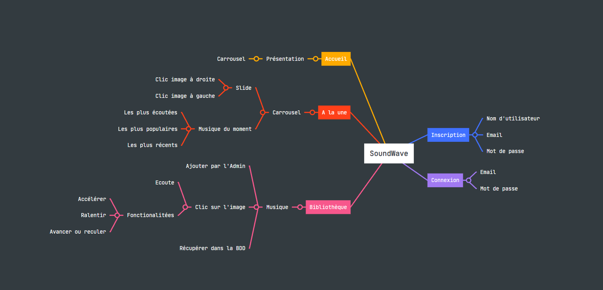

# 
SoundWave
  

## 
Description du projet

  
Le projet SoundWave se base sur une application déjà **existante** nommé [`SoundCloud`](https://soundcloud.com), le principe est simple, pouvoir ajouter des sons de musiques sur le site afin de pouvoir les **écouter**.  
Dans ce projet il y a :
- > _Une base d'accueil afin de **présenter** le site par le biais d'un carrousel,_
- > _Une page à la une **montrant** les musiques les plus **populaire** du moment, sous la même forme d'un carroussel qui va de gauche à droit uniquement lorsqu'on **clique sur** l'image qui se trouve à gauche ou à droite,_
- > _Une section "**blibliothèque**" recensant l'ensemble des musiques présente sur le site._
- > Une page d'inscription et connexion simple :
    > - S'inscrire en y insérant un **nom d'utilisateur**, un **email** ainsi qu'un **mot de passe**,
    > - Se connecter une fois son compte créer avec l'utilisation de l'email pour s'identifier.

## 
Guide d'installation

Afin que le site soit **100% fonctionnel** il faudra intégrer les bases de données correspondantes.
- Pour la **connexion** et pour l'**inscription** il faudra :  
`CREATE TABLE users (
    id INT AUTO_INCREMENT PRIMARY KEY,
    nom VARCHAR(255) NOT NULL,
    password VARCHAR(255) NOT NULL,
    email VARCHAR(255) NOT NULL
);`

- Pour les données des musiques :  
`CREATE TABLE musics (
    nom VARCHAR(255) NOT NULL,
    date DATE NOT NULL,
    musique VARCHAR(255) NOT NULL,
    image VARCHAR(255) NOT NULL
);`

## 
Guide d'utilisation

- **Comment s'inscrire ?**
    - Insérer un `nom d'utilisateur`, un `mail` ainsi qu'un `mot de passe`. L'inscription sera envoyé vers la base de donnée.
- **Comment se connecter ?**
    - Une fois inscrit, se connecter avec `l'email` et `le mot de passe` utiliser lors de l'inscription. Le code fera en sorte de voir si l'utilisateur existe dans la base de donnée, si elle est vérifié alors elle vous connecte, dans le cas contraire il y a un message d'erreur `Email ou mot de passe incorrect`
- La page "bibliothèque" vous montre les musiques présentent sur le site, pour pouvoir `lire les musiques`, il suffit de cliquer sur l'image de la musique et elle se lira automatiquement, il y a des options pour mettre en `pause la musique`, possibilité d'`avancer la musique`, d'`accélérer` ou encore la `ralentir`.

### 
Divers contributeurs 

> 
 YouTube =)  

> 
ChatGPT aussi .-.

### 
Retours d'expérience

Le projet PHP m'a permis de **développer plus d'automonie**, *découvrir comment fonctionne PHP* mais également l'**utilisation de la database**, connecter le code avec la database.  
Une très bonne expérience qui m'a appris beaucoup de chose.
